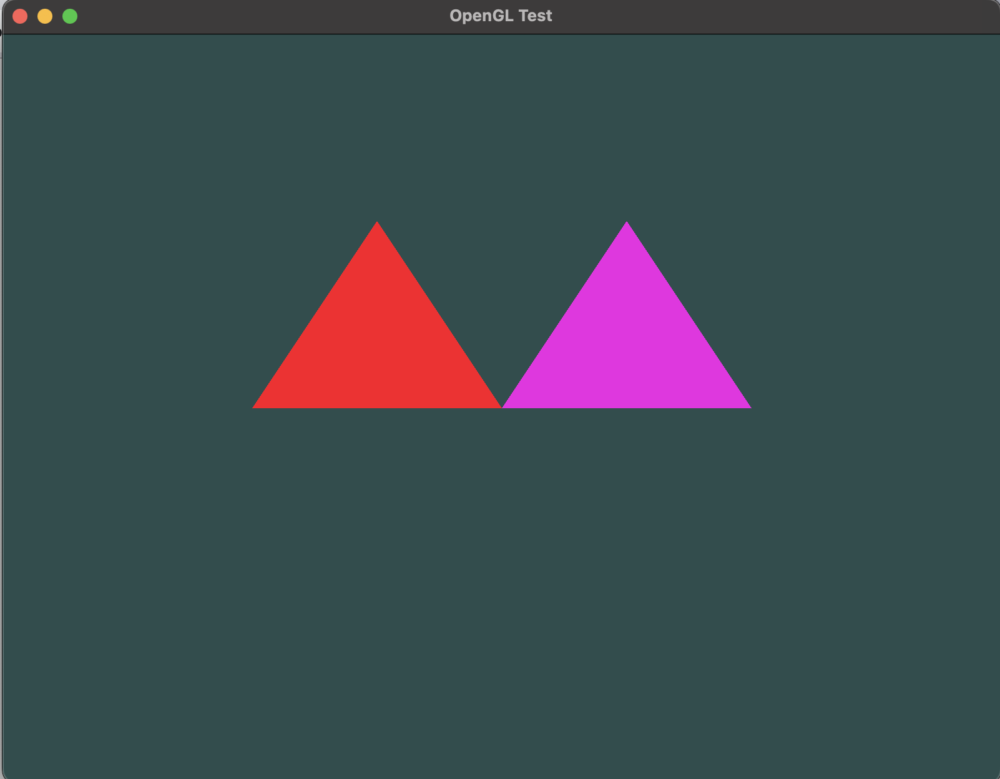

# mainWindow
Just a little application to try to use GLFW and GLEW

## Dependencies

You will need to download the lastest version of 
* GLFW
* GLEW

## Result

After downloading the proper libraries, you should be setup to create graphic interfaces

